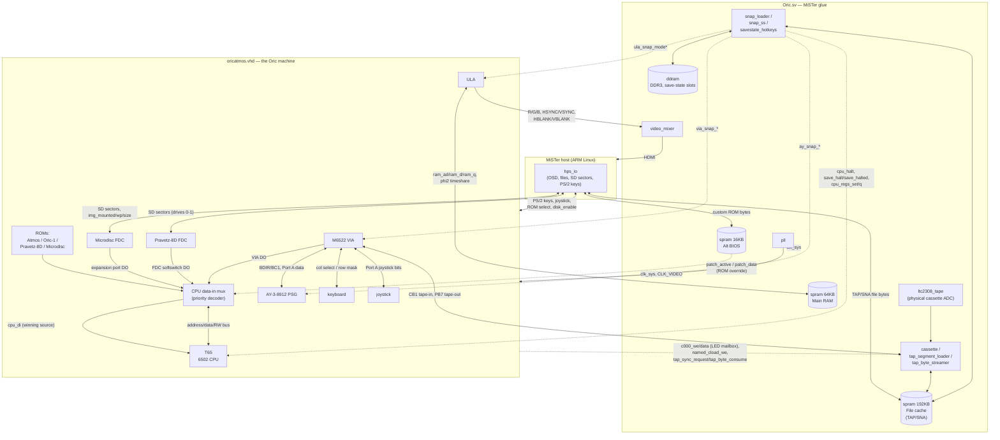
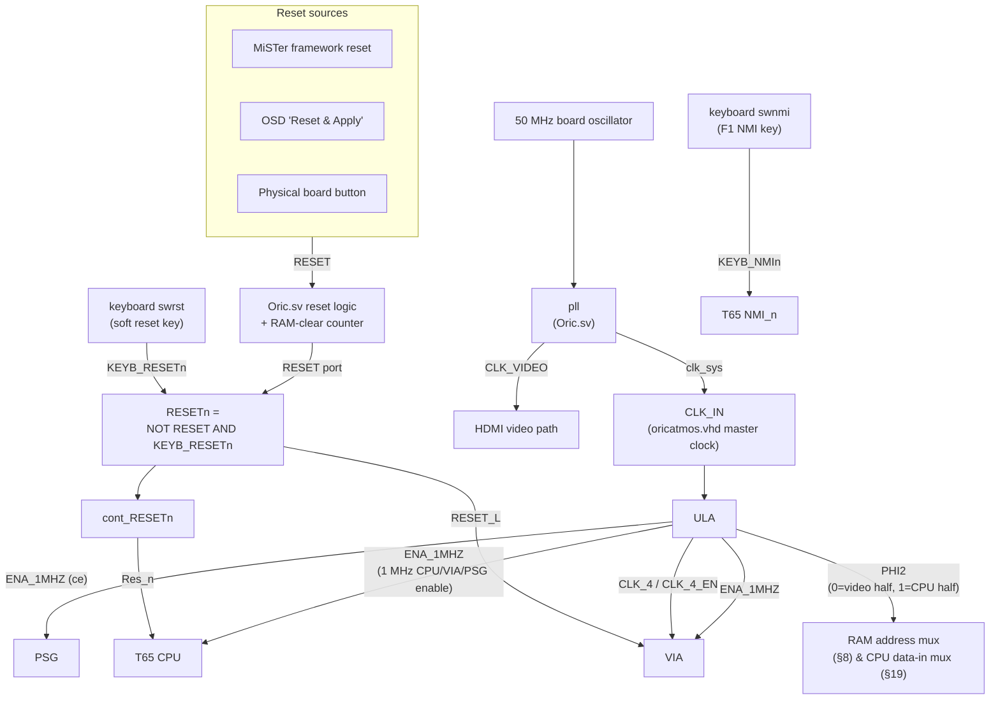

# 01 — Core block diagram

**Date:** 2026-07-09  
**Covers:** [`Oric.sv`](01a-Oric-sv-understanding.md) (MiSTer glue) + [`rtl/oricatmos.vhd`](01b-oricatmos-vhd-understanding.md) (the machine itself).

**Format note:** Mermaid, chosen over plain ASCII or a separate HTML file because it renders as a real diagram directly in Obsidian (this repo is a vault) and on GitHub — no extra tooling, and it stays diffable/git-trackable like the rest of the notes.

---

## Diagram A — Data path

Solid arrows = data/control buses that move every cycle. Dashed arrows = MiSTer-only side-channels (snapshot, tape-speed patching) that don't exist on real hardware.

---

## Diagram B — Clock & reset distribution

---

## Reading notes

- **Buses vs. side-channels:** the solid-arrow paths in Diagram A are what a real Oric-1/Atmos would have — CPU↔ROM/RAM↔ULA↔VIA↔PSG↔keyboard/joystick, plus the Microdisc/Pravetz-8D floppy interfaces. The dashed paths (ROM patch intercept, `$C000` mailbox, snapshot save/restore) are MiSTer-only additions with no hardware equivalent — see [`01b`](01b-oricatmos-vhd-understanding.md) §17–19 and [`01a`](01a-Oric-sv-understanding.md) §14, §17–18.
- **Memory contention:** `PHI2` (Diagram B) is the single signal that ties video timing and CPU timing together — the ULA alternates the RAM address bus between its own video fetch and the CPU every cycle, which is why the emulated CPU effectively runs at 1 MHz despite a 4 MHz+ master clock. See [`01b`](01b-oricatmos-vhd-understanding.md) §8.
- **Why every ROM is "always on":** Diagram A shows all four ROMs feeding the same mux rather than being individually enabled — this mirrors the real approach in [`01b`](01b-oricatmos-vhd-understanding.md) §9/§19: every ROM lookup table runs in parallel every cycle, and a priority decoder picks a winner. Simpler than gating each ROM's clock/output individually.
- **Split disk paths:** Microdisc and Pravetz-8D FDC are fully separate controllers sharing the same SD-card bridge, switched by `rom = "10"` — see [`01b`](01b-oricatmos-vhd-understanding.md) §6, §14–15.

## Still open (future phases)

This diagram covers Phase 1's data/clock path at the module level. It intentionally does **not** yet show:
- Internal state machines within `ula.vhd`, `m6522.vhd`, `wd1793.sv` (Phase 4 per-module notes).
- Bit-level timing/waveforms (Phase 5 simulation).
